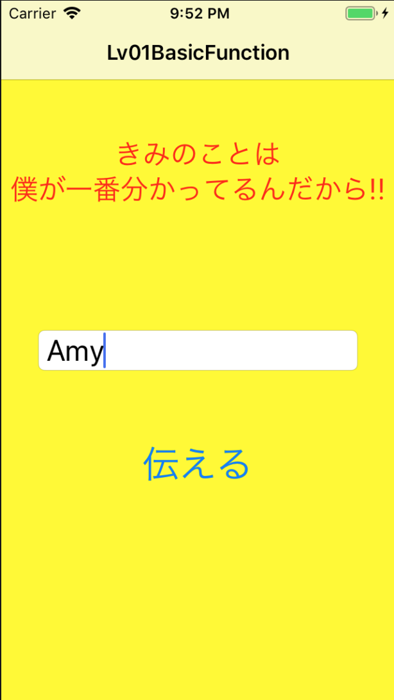
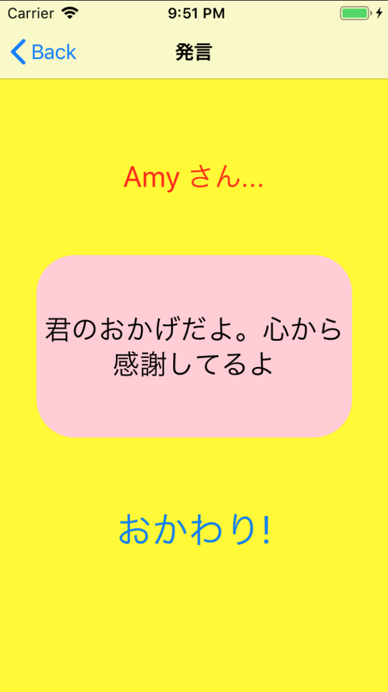

## Basic

*とにかく相手の事を褒めまくるアプリ(for Woman)*

1. 概要

    - 相手のご機嫌を取りストレス発散を手助ける

1. 環境

    - Xcode 10.1
    - Swift 4.2.1
    - Man-hour 1.0h

1. 学び / ポイント

    - UI画面の作り方 / UIViewController
    - アラート画面の作り方 / UIAlertController
    - テキストフィールドの使い方 / UITextField
    - ボタンの使い方 / UIButton
    - 画面遷移データ引継ぎの方法 / UIStoryboardSegue
    - 乱数の使い方 / arc4random_uniform

1. イメージ

    |                           Screen1                           |     |                           Screen2                           |
    |-------------------------------------------------------------|-----|-------------------------------------------------------------|
    |  | >>> |  |

1. ソースコード

    [GitHub](https://github.com/nsuhara/swift-Basic)
